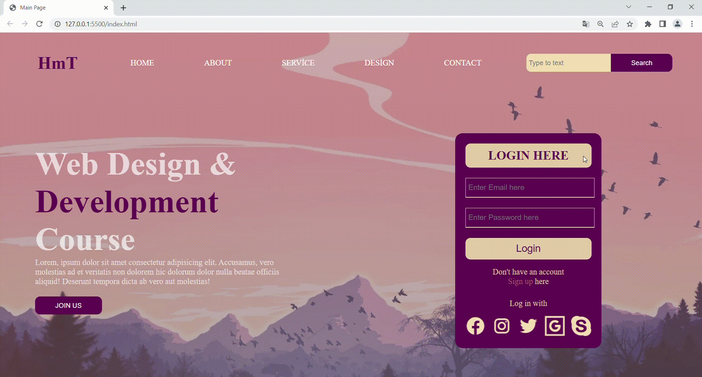

# html7-scss

<h1> Bir Web Sitesi Çalışması</h1>

<h1>Bu projede sadece HTML-CSS ve SCSS kullanılmıştır...</h1>
<h1>Bu projenin SCSS kullanmadan yapılan versiyonuna <a href="https://github.com/hamits/html7">burdan</a> ulaşabilirsiniz</h1>
<h2>Ekran Görüntüsü</h2>

